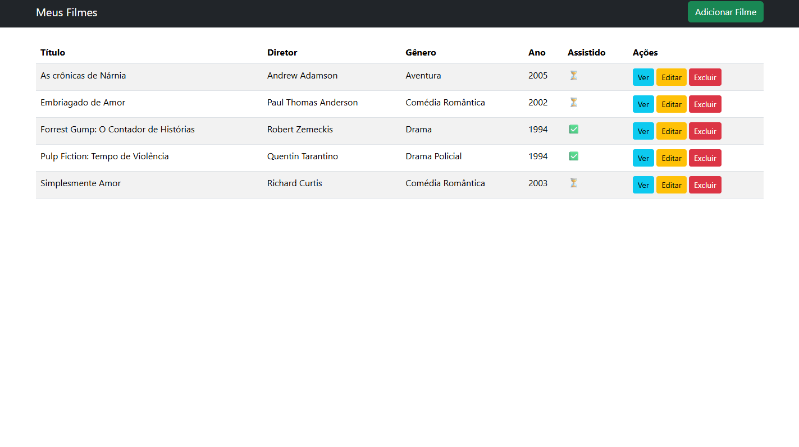
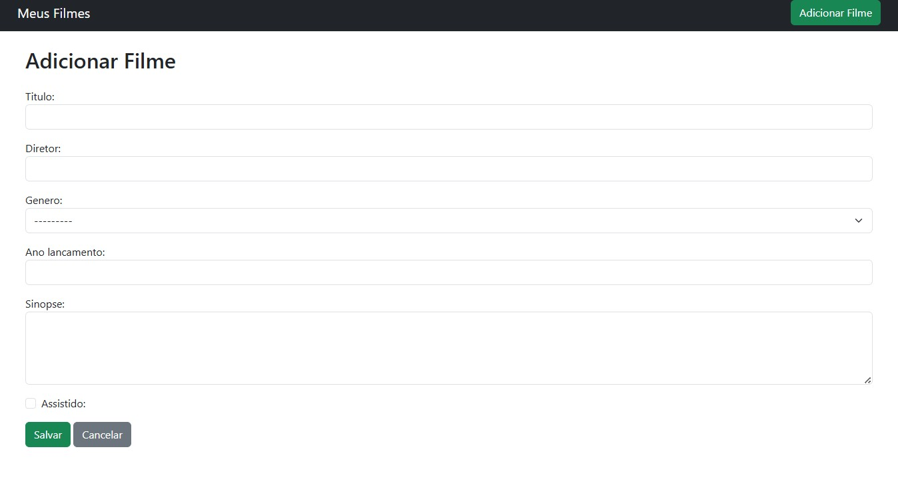
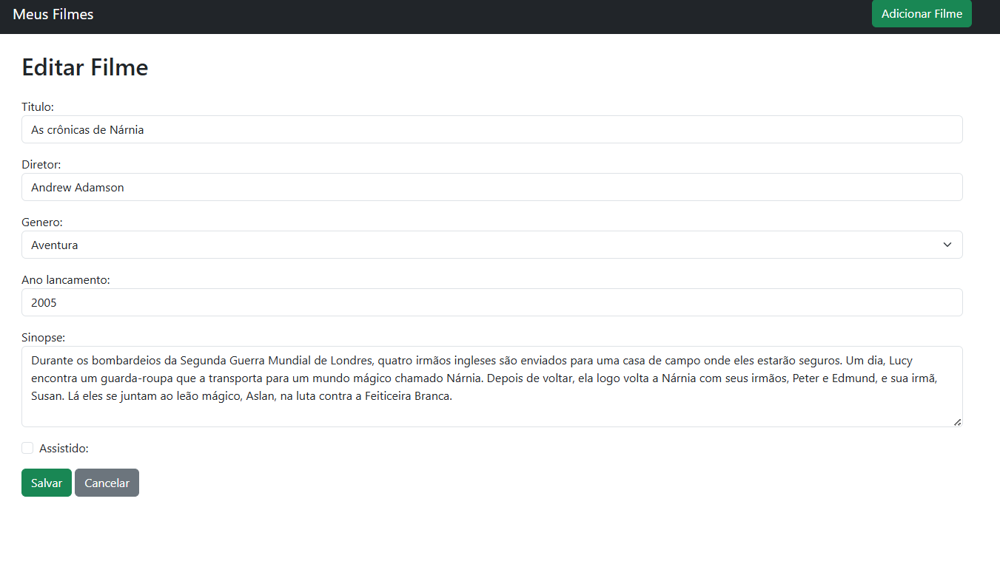
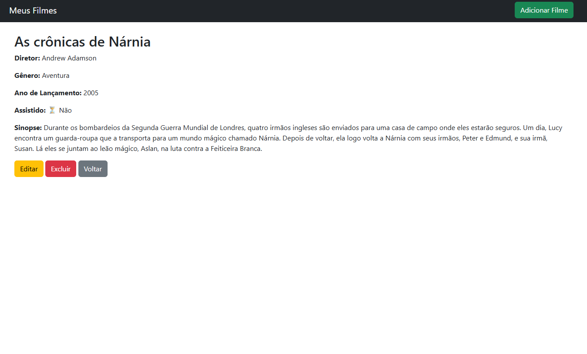
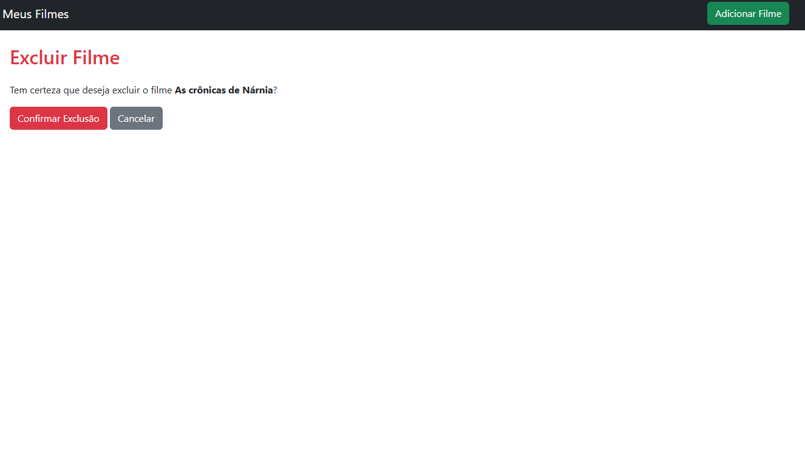

# Projeto Django: Sistema de cadastro e gerenciamento de filmes, com funcionalidades de CRUD: criar, listar, editar, detalhar, desativar e excluir.

## Tecnologias utilizadas
- Python 3.11
- Django 5.2.4
- Bootstrap 5 (front-end)
- SQLite (banco de dados padrão do Django)

## Instalação

1. **Clonar o repositório**
```python
git clone https://github.com/hwtcp/atividade_cbv.git
```
```python
cd atividade_cbv
```
2. **Criar e ativar um ambiente virtual**
  No windows:
```python
python -m venv venv
```
```python
.\venv\Scripts\activate
```
  No Linux:
```python
python3 -m venv venv
```
```python
source venv/bin/activate
```
3. **Instalar dependências**
```python
pip install -r requirements.txt
```
4. **Configurar o projeto**
- Aplicar migrações:
```python
python manage.py makemigrations
```
```python
python manage.py migrate
```

## Execução

1. **Executar o projeto**
```python
python manage.py runserver
```
## Funcionalidades

- Cadastro de filmes com informações básicas
- Listagem de filmes cadastrados
- Edição de filmes
- Detalhes completos do filme
- Excluir filme

## Telas 

**Tela de listagem**

**Tela de cadastrar filmes**

**Tela de editar filme**

**Tela de detalhar filme**

**Tela de confirmar exclusão de filme**

